# 

 
  
  Full-stack Developer ||
   
  UI/UX Designer || 
   Data Analyst  
   ᴄʜᴇᴄᴋ ᴍʏ ᴘᴏʀᴛᴏꜰᴏʟɪᴏ <a href="https://wahyu-bagia.netlify.app/">ʜᴇʀᴇ</a>

## Tech Stack

### 𝙿𝚛𝚘𝚐𝚛𝚊𝚖𝚒𝚗𝚐 𝙻𝚊𝚗𝚐𝚞𝚊𝚐𝚎𝚜

  
  
  
  

### 𝙵𝚛𝚊𝚖𝚎𝚠𝚘𝚛𝚔 & 𝙻𝚒𝚋𝚛𝚊𝚛𝚒𝚎𝚜

  
  
  
  

### 𝙳𝚊𝚝𝚊𝚋𝚊𝚜𝚎

### 𝙳𝚎𝚜𝚒𝚐𝚗

## Currenly Projects

> ### [ᴘᴋʟ ᴊᴏᴜʀɴᴀʟ – ɪɴᴛᴇʀɴꜱʜɪᴘ ʟᴏɢʙᴏᴏᴋ](https://bagiakz-area.github.io/JurnalKu/)

𝙰𝚗 𝚒𝚗𝚝𝚎𝚛𝚗𝚜𝚑𝚒𝚙 𝚓𝚘𝚞𝚛𝚗𝚊𝚕 (𝙿𝙺𝙻) 𝚠𝚎𝚋 𝚊𝚙𝚙𝚕𝚒𝚌𝚊𝚝𝚒𝚘𝚗 𝚠𝚒𝚝𝚑 𝚕𝚘𝚐𝚒𝚗 𝚊𝚗𝚍 𝚛𝚎𝚐𝚒𝚜𝚝𝚛𝚊𝚝𝚒𝚘𝚗 𝚏𝚎𝚊𝚝𝚞𝚛𝚎𝚜. 𝙾𝚗𝚌𝚎 𝚊𝚞𝚝𝚑𝚎𝚗𝚝𝚒𝚌𝚊𝚝𝚎𝚍, 𝚞𝚜𝚎𝚛𝚜 𝚌𝚊𝚗 𝚕𝚘𝚐 𝚝𝚑𝚎𝚒𝚛 𝚍𝚊𝚒𝚕𝚢 𝚒𝚗𝚝𝚎𝚛𝚗𝚜𝚑𝚒𝚙 𝚊𝚌𝚝𝚒𝚟𝚒𝚝𝚒𝚎𝚜, 𝚠𝚒𝚝𝚑 𝚊𝚕𝚕 𝚍𝚊𝚝𝚊 𝚊𝚞𝚝𝚘𝚖𝚊𝚝𝚒𝚌𝚊𝚕𝚕𝚢 𝚜𝚊𝚟𝚎𝚍 𝚊𝚗𝚍 𝚊𝚌𝚌𝚎𝚜𝚜𝚒𝚋𝚕𝚎 𝚊𝚗𝚢𝚝𝚒𝚖𝚎.

**ᴛᴇᴄʜ ꜱᴛᴀᴄᴋ :** `HMTL` `CSS` `JAVASCRIPT` `SUPABASE`

##  Let's Work Together

<h1 align="center">
  ＣＯＮＮＥＣＴ
</h1>

  

  
  
  <a href="https://www.linkedin.com/in/i-gusti-ngurah-kadek-wahyu-bagia-a0a53141b/"></a
  

## Github Statistic

  
  

<picture data-importer="pacman">
  <source media="(prefers-color-scheme: dark)" srcset="https://raw.githubusercontent.com/bagiakz-area/bagiakz-area/pacman-output/breakout-contribution-graph-dark.svg?game=breakout">
  <source media="(prefers-color-scheme: light)" srcset="https://raw.githubusercontent.com/bagiakz-area/bagiakz-area/pacman-output/breakout-contribution-graph.svg?game=breakout">
  
</picture>

